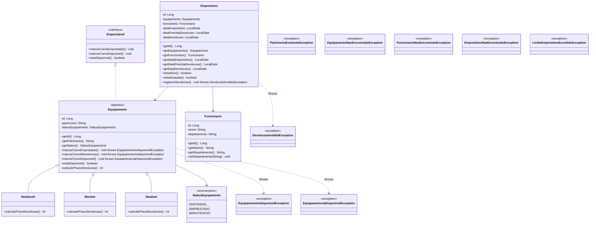

# Sistema de Empréstimo de Equipamentos de TI

Sistema de gerenciamento de empréstimos de equipamentos de TI desenvolvido em Java como projeto de prática. Permite cadastrar equipamentos e funcionários, realizar empréstimos e devoluções, com controle de prazo e controle de quantidade de empréstimos ativos por funcionário.

## Sobre o Projeto

Este projeto foi criado com objetivo de praticar conceitos fundamentais em Java e boas práticas de desenvolvimento, incluindo:

- Programação Orientada a Objeto (POO)
- Separação de responsabilidades em camadas (Model, Repository, Service, UI)
- Tratamento de exceções customizadas
- Uso de coleções (`HashMap`, `List`) e Streams
- Testes unitários com JUnit e Mockito

## Funcionalidades

- Cadastrar funcionários (Com nome e departamento)
- Cadastrar equipamentos (Com patrimônio)
- Realizar no máximo 3 empréstimos para um funcionário
- Realizar devolução com cálculo automático de atraso
- Prazo padrão de empréstimo por equipamento: 30 dias para notebooks, 90 dias para monitores e 15 dias para headsets
- Listar equipamentos atrasados
- Relatório de equipamentos por status

## Estrutura do Projeto

```
src/
├── main/java/
│   ├── Main.java
│   ├── emprestimos/
│   │   ├── model/
│   │   │   └── Emprestimo.java
│   │   ├── repository/
│   │   │   └── EmprestimoRepository.java
│   │   └── service/
│   │       └── EmprestimoService.java
│   ├── equipamentos/
│   │   ├── enums/
│   │   │   └── StatusEquipamento.java
│   │   ├── model/
│   │   │   ├── Emprestavel.java
│   │   │   ├── Equipamento.java
│   │   │   ├── Headset.java
│   │   │   ├── Monitor.java
│   │   │   └── Notebook.java
│   │   └── repository/
│   │       └── EquipamentoRepository.java
│   ├── funcionarios/
│   │   ├── model/
│   │   │   └── Funcionario.java
│   │   └── repository/
│   │       └── FuncionarioRepository.java
│   ├── exceptions/
│   │   ├── DevolucaoInvalidaException.java
│   │   ├── EmprestimoNaoEncontradoException.java
│   │   ├── EquipamentoIndisponivelException.java
│   │   ├── EquipamentoJaDisponivelException.java
│   │   ├── EquipamentoNaoEncontradoException.java
│   │   ├── FuncionarioNaoEncontradoException.java
│   │   ├── LimiteEmprestimoExcedidoException.java
│   │   └── PatrimonioExistenteException.java
│   └── ui/
│       └── Menu.java
└── test/java/
    ├── emprestimos/
    │   ├── model/
    │   │   └── EmprestimoTest.java
    │   └── service/
    │       └── EmprestimoServiceTest.java
    └── equipamentos/
        └── model/
            └── EquipamentoTest.java
```

## Tecnologias

- Java 21
- Maven
- JUnit
- Mockito

## Arquitetura



## Como Executar

**Pré-requisitos:** Java 21+ e Maven instalados

```bash
# Compilar o projeto
mvn compile

# Executar a aplicação
mvn exec:java -Dexec.mainClass="Main"
```

Ou abra o projeto na sua IDE (IntelliJ, Eclipse) e execute a classe `Main.java`.

## Testes

O projeto conta com 15 testes automatizados usando JUnit e Mockito, cobrindo:

- Criação de equipamentos e transições de estado (válidas e inválidas)
- Regras de negócio de `Emprestimo` (atraso, devolução duplicada)
- A regra central do sistema: limite de 3 empréstimos ativos por funcionário, testada com mocks dos repositórios

Para rodar os testes:

```bash
mvn test
```

## Decisões Técnicas

**Geração de ID pelo Repository:** o ID de cada entidade é gerado pelo respectivo `Repository`, não pelo `Service` ou pela própria entidade. Isso centraliza a geração numa única fonte de verdade, evitando risco de duplicidade caso existam múltiplos pontos de criação no futuro.

**Validação de estado dentro da própria entidade:** em vez de um `setStatus()` genérico controlado externamente, `Equipamento` expõe métodos específicos (`marcarComoEmprestado()`, `marcarComoManutencao()`, `marcarComoDisponivel()`) que validam a transição internamente e lançam exceção quando inválida. Essa é uma regra de consistência interna — depende só do próprio objeto, então faz mais sentido o objeto se proteger sozinho do que confiar que quem chama vai validar antes.

**Associação unidirecional entre `Emprestimo`, `Equipamento` e `Funcionario`:** apenas `Emprestimo` conhece `Equipamento` e `Funcionario` — o inverso não existe (nem `Equipamento` nem `Funcionario` guardam referência a seus empréstimos). Isso evita o risco de dessincronia que existiria numa associação bidirecional, onde seria necessário lembrar de atualizar os dois lados sempre que um empréstimo fosse criado ou encerrado.

**Cálculo dinâmico de `estaAtrasado()` e `estaAtivo()`:** nenhum desses estados é guardado como campo booleano. Ambos são calculados na hora, a partir de `dataDevolucao` e `dataPrevistaDevolucao`. Isso evita a necessidade de manter um campo sincronizado manualmente, que ficaria desatualizado se alguém esquecesse de atualizá-lo.

**Exceções específicas em vez de genéricas:** o projeto usa exceções de negócio dedicadas para cada cenário de erro (`EquipamentoIndisponivelException`, `EquipamentoJaDisponivelException`, `DevolucaoInvalidaException`, `LimiteEmprestimoExcedidoException`, entre outras), em vez de reaproveitar uma única exceção genérica. Isso deixa mais claro qual problema específico ocorreu, tanto para quem lê o código quanto para quem eventualmente precisar tratar cada erro de forma diferente.

**Coleções retornadas de forma imutável:** todos os métodos de listagem dos repositórios (`listarTodos()`, `listarPorStatus()`, `listarAtivos()`, `listarAtrasados()`) retornam listas imutáveis (`List.copyOf`/`Collectors.toUnmodifiableList`), impedindo que código externo modifique o estado interno dos repositórios por acidente.

**Injeção de dependência via construtor:** `EmprestimoService` recebe os três repositórios (`EmprestimoRepository`, `EquipamentoRepository`, `FuncionarioRepository`) por parâmetro no construtor, em vez de instanciá-los internamente. Isso torna a classe testável — permite substituir os repositórios reais por mocks (Mockito) nos testes, sem depender de estado real em memória.

## Possíveis Melhorias Futuras

- **Persistência real:** hoje os repositórios guardam tudo em memória (`HashMap`), então os dados somem a cada execução. Migrar para arquivo (JSON/CSV) ou banco de dados (H2, SQLite, PostgreSQL via JDBC/JPA) seria o próximo passo natural.
- **Camada de Service para Funcionário e Equipamento:** só existe `EmprestimoService`; o cadastro de funcionários e equipamentos é feito direto no `Menu` chamando o `Repository`. Criar `FuncionarioService` e `EquipamentoService` deixaria a UI mais fina e centralizaria validações de negócio.
- **Edição e exclusão de cadastros:** atualmente dá pra cadastrar funcionário/equipamento, mas não editar ou remover. Adicionar `atualizar()`/`remover()` nos repositórios e no menu.
- **Validação de entrada mais robusta:** o `Menu` lê do `Scanner` sem muito tratamento para entradas inválidas (texto onde se espera número, opções fora do enum, etc.). Um loop de validação com mensagens de erro específicas melhoraria a experiência.
- **Histórico completo de empréstimos por funcionário/equipamento:** hoje dá pra listar atrasados e por status, mas não existe um relatório "todos os empréstimos de um funcionário X" ou "histórico de um equipamento Y".
- **Internacionalização de mensagens:** extrair os textos fixos (menus, mensagens de erro) para um arquivo de propriedades, preparando o sistema para múltiplos idiomas.
- **Logs estruturados:** substituir `System.out.println` por um logger (SLF4J + Logback), permitindo níveis de log (INFO, WARN, ERROR) e melhor rastreabilidade.
- **Cobertura de testes maior:** os testes atuais cobrem bem `Equipamento`, `Emprestimo` e `EmprestimoService`, mas faltam testes para `Menu`, `FuncionarioRepository` e `EquipamentoRepository`.
- **Empacotamento executável:** gerar um `.jar` executável (via `maven-shade-plugin` ou `maven-assembly-plugin`) para facilitar a distribuição sem depender do Maven na máquina de quem for rodar.
- **API REST:** expor as funcionalidades via Spring Boot, transformando o projeto de console para uma aplicação web com endpoints para cada operação — um bom próximo passo para praticar camadas de controller/DTO.
- **Integração contínua (CI):** adicionar um workflow do GitHub Actions para rodar `mvn test` automaticamente a cada push/PR.